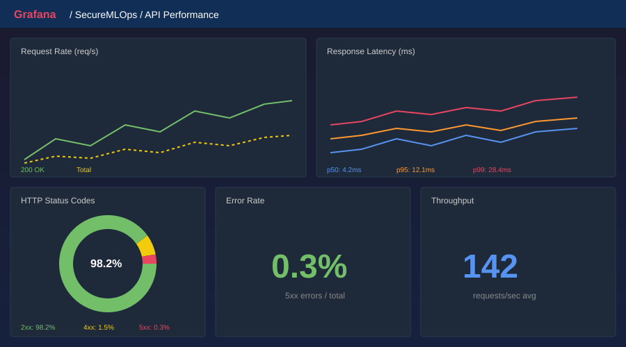
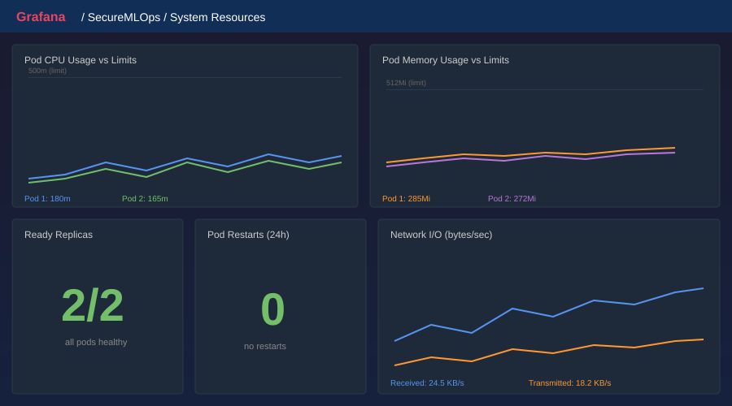
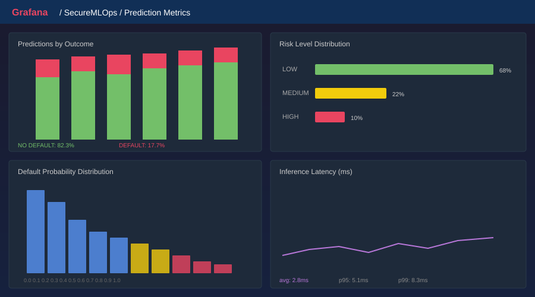
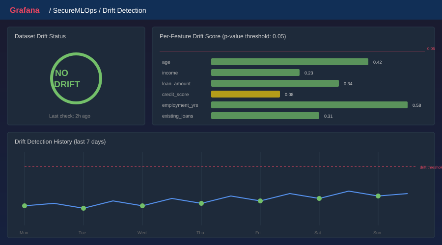

# SecureMLOps


A secure ML model delivery pipeline combining DevSecOps and MLOps practices. Built as a 12-week DevOps capstone project demonstrating end-to-end machine learning operations with security-first principles.

## Overview

SecureMLOps delivers a loan default prediction model through a fully automated pipeline — from model training and containerization to Kubernetes deployment with continuous monitoring and drift detection. Every stage integrates security scanning to ensure production-grade safety.

### Key Features

- **ML API** -- FastAPI serving a RandomForest loan default prediction model with real-time inference
- **Kubernetes Deployment** -- Helm-managed deployment on Minikube with rolling updates and rollback support
- **Monitoring Stack** -- Prometheus + Grafana with custom ML metrics (prediction counts, latency, risk distribution)
- **Drift Detection** -- Evidently AI comparing production data against training baselines on a scheduled CronJob
- **Security Pipeline** -- Gitleaks, Bandit, SonarQube, and Trivy integrated into CI/CD
- **Infrastructure as Code** -- Ansible playbooks for automated environment provisioning

## Architecture

See [docs/architecture.md](docs/architecture.md) for detailed Mermaid diagrams.

```
                    +------------------+
                    |   GitHub Repo    |
                    +--------+---------+
                             |
                    +--------v---------+
                    |  Jenkins CI/CD   |
                    |  (11 stages)     |
                    +--------+---------+
                             |
              +--------------+--------------+
              |                             |
     +--------v---------+        +---------v--------+
     | Security Scanning|        |   Docker Build   |
     | Gitleaks/Bandit/ |        |   Multi-stage    |
     | SonarQube/Trivy  |        |   Non-root       |
     +------------------+        +---------+--------+
                                           |
                    +----------------------v-----------+
                    |     Minikube K8s Cluster          |
                    |                                   |
                    |  +----------+    +----------+    |
                    |  | ML API   |    | ML API   |    |
                    |  | Pod 1    |    | Pod 2    |    |
                    |  +----+-----+    +-----+----+    |
                    |       |                |          |
                    |  +----v----------------v----+    |
                    |  | Prometheus + Grafana      |    |
                    |  | + Evidently Drift CronJob |    |
                    |  +---------------------------+    |
                    +-----------------------------------+
```

## Tech Stack

| Layer | Technologies |
|-------|-------------|
| **ML/API** | Python 3.10, FastAPI, scikit-learn, MLflow, joblib |
| **Containers** | Docker (multi-stage builds), Docker Compose |
| **Orchestration** | Kubernetes (Minikube), Helm |
| **IaC** | Ansible (roles: prerequisites, minikube, app_deploy) |
| **CI/CD** | Jenkins (Jenkinsfile) |
| **Monitoring** | Prometheus, Grafana, Evidently AI |
| **Security** | Gitleaks, Bandit, SonarQube, Trivy, OPA |
| **SCM** | Git + GitHub (GitFlow branching) |

## Project Structure

```
secure-mlops/
|-- ml-app/                    # ML application
|   |-- api/main.py            # FastAPI app with Prometheus metrics
|   |-- model/train.py         # Model training script
|   |-- model/artifacts/       # Trained model, schema, metrics
|   |-- tests/test_api.py      # 7 unit tests
|   |-- Dockerfile             # Multi-stage, non-root container
|   +-- requirements.txt
|
|-- k8s/                       # Kubernetes configurations
|   |-- manifests/             # Raw K8s deployment + service
|   |-- helm-chart/            # Helm chart with templates for:
|   |   +-- securemlops/       #   deployment, service, servicemonitor,
|   |                          #   drift cronjob, blue-green templates
|   |-- rollback.sh            # Rollback script with health verification
|   +-- blue-green-switch.sh   # Blue-green deployment traffic switch
|
|-- monitoring/                # Observability stack
|   |-- prometheus/            # kube-prometheus-stack values, ServiceMonitor
|   |-- grafana/dashboards/    # 4 JSON dashboards (API, system, predictions, drift)
|   |-- evidently/             # Drift detector (script, Dockerfile, requirements)
|   +-- setup-monitoring.sh    # One-command monitoring setup
|
|-- ansible/                   # Infrastructure as Code
|   |-- playbooks/             # setup-environment, deploy-app, teardown
|   |-- roles/                 # prerequisites, minikube, app_deploy
|   +-- inventory/hosts.yml
|
|-- tests/load/                # Load testing
|   |-- locustfile.py          # Locust test scenarios
|   |-- run-benchmark.sh       # Automated benchmark runner
|   +-- requirements.txt       # Locust dependencies
|
|-- ci/Jenkinsfile             # 11-stage CI/CD pipeline
|-- security/                  # Security tool configs (gitleaks, trivy, OPA)
|-- docker-compose.yml         # Local dev: PostgreSQL + MLflow + API
|-- mlflow.Dockerfile          # MLflow tracking server
+-- docs/architecture.md       # Mermaid architecture diagrams
```

## Quick Start

### Prerequisites

- Docker
- Minikube
- kubectl
- Helm 3
- Python 3.10+ (for local development)
- Ansible (for automated setup)

### Option 1: Automated Setup with Ansible

```bash
cd ansible
ansible-playbook playbooks/setup-environment.yml
```

This installs all prerequisites, starts Minikube, builds the Docker image, and deploys the app via Helm.

### Option 2: Manual Setup

**1. Start Minikube**

```bash
minikube start --driver=docker --cpus=2 --memory=4096
```

**2. Build the Docker image in Minikube**

```bash
eval $(minikube docker-env)
cd ml-app && docker build -t secure-mlops-api:v1 .
```

**3. Deploy with Helm**

```bash
helm install securemlops k8s/helm-chart/securemlops/
```

**4. Access the API**

```bash
kubectl port-forward service/securemlops-service 8080:80
# API available at http://localhost:8080
# Swagger docs at http://localhost:8080/docs
```

**5. Setup monitoring**

```bash
cd monitoring && bash setup-monitoring.sh
# Grafana at NodePort 31000 (admin / securemlops)
```

### Option 3: Local Development with Docker Compose

```bash
docker-compose up --build
# API: http://localhost:8000
# MLflow: http://localhost:5000
```

## API Usage

### Predict Loan Default

```bash
curl -X POST http://localhost:8080/predict \
  -H "Content-Type: application/json" \
  -d '{
    "age": 35,
    "income": 75000,
    "loan_amount": 15000,
    "credit_score": 720,
    "employment_years": 10,
    "num_existing_loans": 2
  }'
```

**Response:**
```json
{
  "prediction": "NO DEFAULT",
  "default_probability": 0.0312,
  "risk_level": "LOW",
  "inference_time_ms": 2.45
}
```

### Other Endpoints

| Endpoint | Method | Description |
|----------|--------|-------------|
| `/predict` | POST | Loan default prediction |
| `/health` | GET | Liveness probe |
| `/ready` | GET | Readiness probe |
| `/model/info` | GET | Model metadata and metrics |
| `/metrics` | GET | Prometheus metrics |
| `/docs` | GET | Swagger UI |

## Monitoring

### Grafana Dashboards

Four pre-configured dashboards are auto-provisioned:

**API Performance** -- Request rate, p50/p95/p99 latency, HTTP status codes, error rate



**System Resources** -- Pod CPU/memory usage vs limits, restarts, ready replicas, network I/O



**Prediction Metrics** -- Prediction counts by outcome/risk, probability distribution, inference latency



**Drift Detection** -- Dataset drift status, per-feature drift scores, drift history timeline



### Drift Detection

Evidently AI runs as a K8s CronJob every 6 hours, comparing production prediction inputs against the training test set baseline. Drift metrics are pushed to Prometheus via Pushgateway and visualized in Grafana.

To trigger a manual drift check:

```bash
kubectl create job --from=cronjob/securemlops-drift-detection drift-manual-$(date +%s)
```

## Deployment Strategies

### Rolling Update (default)

The default strategy uses rolling updates (maxSurge=1, maxUnavailable=0) for zero-downtime deployments.

### Blue-Green Deployment

Blue-green deployment maintains two identical environments. Only one serves live traffic at a time, enabling instant rollback by switching the service selector.

**Enable blue-green mode:**

```bash
helm upgrade securemlops k8s/helm-chart/securemlops/ \
    --set blueGreen.enabled=true \
    --set blueGreen.blue.image.tag=v1 \
    --set blueGreen.green.image.tag=v2
```

**Deploy a new version to the inactive slot:**

```bash
bash k8s/blue-green-switch.sh --deploy v3
```

**Preview the new version before switching:**

```bash
kubectl port-forward service/securemlops-preview 8081:80
# Test at http://localhost:8081
```

**Switch live traffic:**

```bash
bash k8s/blue-green-switch.sh           # Switch to inactive slot
bash k8s/blue-green-switch.sh green     # Switch to specific slot
bash k8s/blue-green-switch.sh --status  # View current status
```

## Rollback

The deployment uses a rolling update strategy (maxSurge=1, maxUnavailable=0) with 5 revision history for rollback.

```bash
# Roll back to previous version
bash k8s/rollback.sh

# Roll back to specific revision
bash k8s/rollback.sh 3

# List available revisions
bash k8s/rollback.sh --list

# Check current deployment status
bash k8s/rollback.sh --status
```

## Running Tests

### Unit Tests

```bash
cd ml-app
source venv/bin/activate
pytest tests/test_api.py -v
```

7 tests covering health checks, valid/invalid predictions, edge cases, and model info.

### Load Testing

Load tests use [Locust](https://locust.io/) to simulate realistic traffic against the prediction API.

**Quick benchmark (headless):**

```bash
pip install -r tests/load/requirements.txt
bash tests/load/run-benchmark.sh --users 50 --duration 60
```

**Interactive mode (web UI at http://localhost:8089):**

```bash
locust -f tests/load/locustfile.py --host http://localhost:8080
```

**Custom benchmark:**

```bash
bash tests/load/run-benchmark.sh \
    --host http://192.168.49.2:30080 \
    --users 100 \
    --spawn-rate 10 \
    --duration 120
```

Reports are saved to `tests/load/results/` as HTML and CSV.

## Team

| Member | Role | Responsibilities |
|--------|------|-----------------|
| **Devang** (Lead) | Infrastructure & Deployment | Kubernetes, Helm, Ansible, Prometheus, Grafana, Evidently AI |
| **Yashasvi** | Security Lead | SonarQube, Gitleaks, Bandit, Trivy, OPA |
| **Nikhil** | CI/CD Pipeline Lead | Jenkins, Jenkinsfile |

## Model Details

- **Algorithm**: RandomForestClassifier (100 estimators, max_depth=10)
- **Features**: age, income, loan_amount, credit_score, employment_years, num_existing_loans
- **Training Data**: 5,000 synthetic loan records
- **Performance**: Accuracy 98.2%, Precision 94.1%, Recall 82.1%, F1 87.7%
- **Risk Levels**: LOW (<0.3), MEDIUM (0.3-0.6), HIGH (>0.6) default probability
