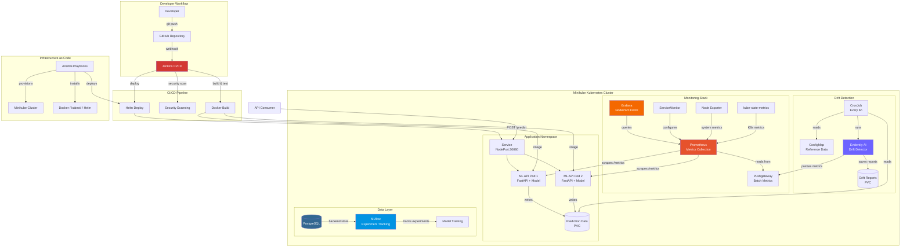
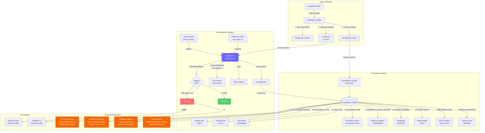

# SecureMLOps Architecture

## 1. Overall System Architecture

## 2. CI/CD Pipeline Flow

```mermaid
graph LR
    subgraph "Stage 1: Source"
        S1[Git Checkout<br/>GitHub Webhook]
    end

    subgraph "Stage 2: Secret Scan"
        S2[Gitleaks<br/>Detect hardcoded<br/>secrets & keys]
    end

    subgraph "Stage 3: SAST"
        S3A[Bandit<br/>Python security<br/>analysis]
        S3B[SonarQube<br/>Code quality &<br/>vulnerability scan]
    end

    subgraph "Stage 4: Unit Tests"
        S4[pytest<br/>7 API tests<br/>health / predict /<br/>validation / model]
    end

    subgraph "Stage 5: Build"
        S5[Docker Build<br/>Multi-stage<br/>non-root image]
    end

    subgraph "Stage 6: Image Scan"
        S6[Trivy<br/>Container image<br/>vulnerability scan]
    end

    subgraph "Stage 7: Deploy"
        S7[Helm Upgrade<br/>Rolling update<br/>zero-downtime]
    end

    subgraph "Stage 8: Verify"
        S8[Health Check<br/>Smoke tests<br/>Rollout status]
    end

    S1 --> S2 --> S3A --> S4
    S3A --> S3B
    S3B --> S4
    S4 --> S5 --> S6 --> S7 --> S8

    S8 -->|failure| ROLLBACK[Helm Rollback<br/>Previous Revision]
    S8 -->|success| DONE[Deploy Complete]

    style S2 fill:#ff6b6b,color:#fff
    style S3A fill:#ff6b6b,color:#fff
    style S3B fill:#ff6b6b,color:#fff
    style S6 fill:#ff6b6b,color:#fff
    style S4 fill:#51cf66,color:#fff
    style S5 fill:#339af0,color:#fff
    style S7 fill:#339af0,color:#fff
    style ROLLBACK fill:#fcc419,color:#000
    style DONE fill:#51cf66,color:#fff
```

### Pipeline Stage Details

| Stage | Tool | Purpose | Failure Action |
|-------|------|---------|---------------|
| 1. Source | Git | Checkout code from GitHub | Abort pipeline |
| 2. Secret Scan | Gitleaks | Detect hardcoded secrets, API keys, passwords | Block merge |
| 3. SAST | Bandit + SonarQube | Static analysis for Python vulnerabilities, code smells | Block merge |
| 4. Unit Tests | pytest | Validate API endpoints, model predictions, input validation | Block merge |
| 5. Build | Docker | Multi-stage build with non-root user | Abort pipeline |
| 6. Image Scan | Trivy | Scan container image for CVEs (HIGH/CRITICAL) | Block deploy |
| 7. Deploy | Helm | Rolling update to Kubernetes (maxSurge=1, maxUnavailable=0) | Rollback |
| 8. Verify | kubectl | Health checks, rollout status, smoke tests | Rollback |

## 3. Monitoring and Drift Detection Flow

### Metrics Reference

#### Application Metrics (from FastAPI)

| Metric | Type | Labels | Description |
|--------|------|--------|-------------|
| `ml_predictions_total` | Counter | prediction, risk_level | Total predictions served |
| `ml_prediction_duration_seconds` | Histogram | - | Model inference time |
| `ml_default_probability` | Histogram | - | Distribution of default probabilities |
| `ml_model_loaded` | Gauge | - | Model load status (1/0) |
| `http_requests_total` | Counter | handler, method, status | HTTP request counts |
| `http_request_duration_seconds` | Histogram | handler | HTTP request latency |

#### Drift Metrics (from Evidently via Pushgateway)

| Metric | Type | Labels | Description |
|--------|------|--------|-------------|
| `ml_drift_dataset_detected` | Gauge | - | Dataset-level drift (1/0) |
| `ml_drift_share` | Gauge | - | Fraction of drifted features |
| `ml_drift_columns_count` | Gauge | - | Number of drifted columns |
| `ml_drift_feature_score` | Gauge | feature | Per-feature drift score |
| `ml_drift_feature_detected` | Gauge | feature | Per-feature drift flag (1/0) |
| `ml_drift_last_run_timestamp` | Gauge | - | Last detection run time |

#### System Metrics (from Node Exporter + kube-state-metrics)

| Metric | Type | Description |
|--------|------|-------------|
| `container_cpu_usage_seconds_total` | Counter | Pod CPU usage |
| `container_memory_working_set_bytes` | Gauge | Pod memory usage |
| `kube_pod_container_status_restarts_total` | Counter | Pod restart count |
| `kube_deployment_status_replicas_ready` | Gauge | Ready replicas |
